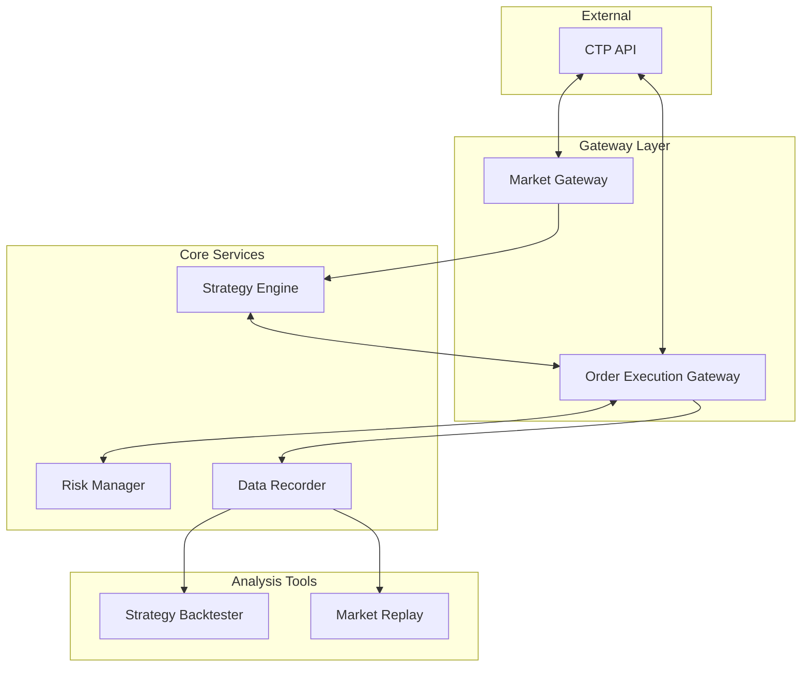

# Nilotica

  

## 欢迎回家!
Nilotica V0.1.2 已启用全新风格标识和文档, 欢迎回家！ <mark>这里是 Nilotica 的使用文档！</mark>
## Nilotica 是什么?
基于 VNPY 构建的量化交易系统，通过行情网关、订单执行网关、策略引擎三大核心组件，实现行情的获取、行情的转发、订单的发送的订单功能。

::: details VNPY 介绍
vnpy 作为开源量化交易平台开发框架，凭借丰富组件、灵活架构，为策略设计、交易执行全方位支撑。
:::

## Nilotica 系统架构

## Nilotica 与其它框架的本质不同?
Nilotica 与很多框架都有本质性的区别：

1. **架构相比**  
   Nilotica 采用类似微服务的架构，松散耦合的组件通过 ZeroMQ 消息传递协议连接。这种设计可以实现更好的故障隔离、独立扩展和服务复用性。
2. **沟通机制相比**  
   Nilotica 使用 ZeroMQ 进行组件间通信，实现两种主要的消息传递模式：
   - **发布-订阅（PUB/SUB）**：用于向多个消费者广播市场数据和订单/交易报告
   - **请求-回复（REQ/REP）**：用于发送订单请求和接收响应

## Nilotica 的小小故事!
::: details 小小的故事...
在一个遥远的、充满奇幻与科技交织的世界——**量化交易**，有一种神秘且强大的力量，叫做 **VNPY**。这股力量，简直就像是一颗随时可能爆炸的定时炸弹，能改变一切，却又异常难以控制。很多英雄、巫师、冒险者们曾试图驾驭它，结果都失败得一塌糊涂，甚至连他们的名字都被历史遗忘了，仿佛从未存在过。 

然而，在这个充满混乱的世界里，有一只小猫娘，名字叫做 **Nilotica**，她不仅是这个故事的主角，而且简直是这个世界最萌最可爱的"灾难制造机"。Nilotica 外表乖巧，萌萌哒，软乎乎的，简直像个大大的毛球，走路一摇一摆的，超乎想象的笨拙。她曾经被遗弃在一个荒凉的角落里，孤零零地生活着。但某天，她突然发现了一个超级神奇的东西——**ZeroMQ**！ 

"诶？这是什么？看起来像是能吃的样子...可是为什么一点也不好吃呢？"

于是，Nilotica 就开始了对这门语言的探索——虽然她并不完全理解它，但她凭着直觉和那种天生的好奇心，成功破解了 ZeroMQ 的奥秘，并意外地与传说中的 **VNPY** 产生了连接。

虽然看起来她像是无害的傻萌猫娘，但 Nilotica 的这项技能竟然能在没有任何计划的情况下，操控 VNPY 的某些功能，甚至能轻松改变现实的规则！但问题是……她的每次操作，基本上都是胡乱点击、乱敲键盘、然后出奇不意地发生了不想要的结果。

"嗯？我是不是把天空变得五颜六色了？咦？月亮不见了？咕噜咕噜……好像做错了什么事呢。"

于是，一切开始变得混乱不堪。天空瞬间变成了彩虹色，时间突然在某些地方停滞，甚至连月亮都神秘消失了！整个世界都被这只小猫娘的"无心之举"搞得一团糟，灾难的阴影笼罩了整个世界。 

就在大家都以为一切都完了，世界即将崩塌的时候，出现了一个强大的英雄。他不是什么骑着白马，手持宝剑的传统英雄，而是一个比任何人都冷静的智者。他决定采取一种不同的方式来解决这个问题：**微服务架构**。

"一切都得按照规范来！否则她会再把世界变成一锅粥！"英雄心想。

这个英雄明白，Nilotica 的能力太强大，控制不住的话，真的会把世界毁掉。因此，这位应用采用前辈们广泛使用的微服务架构规范，规定 Nilotica 任何操作都要写道 **ZeroMQ** 这种纸张上，每次使用 VNPY 的力量时，都要在"纸上"写下相应的指令，才能让 VNPY 按照预设的方式执行任务。而且每次任务完成后，数据也会通过同样的"纸面"反馈回来，确保一切都在可控范围内。

"啊？这个纸好像好难理解……但是，哦，原来是这么回事呀！"

于是，Nilotica 开始在这套严格的规范下与 VNPY 建立了微妙的关系。她不再是那个随便敲敲代码就让天空变色的笨蛋，而是通过认真的输入和执行指令，逐渐恢复了世界的秩序。

可虽然一切变得井然有序，Nilotica 依旧是那个呆萌、迷糊的猫娘。她依然在"纸"上写着自己不太明白的指令，每次完成任务后，她都会露出一副"我是不是做对了？"的迷茫表情，仿佛在问："哎？我这次没搞砸吧？"

尽管如此，大家也逐渐接受了她的笨拙，因为她那种天真可爱的样子实在让人忍不住心软。最重要的是，世界终于恢复了平静，大家都知道，这只猫娘虽然有时候会闹出点小乱子，但她那份纯真与努力，才是让这个世界重新恢复平衡的力量。

从那时起，Nilotica 与 VNPY 之间的微妙平衡保持着，而你也可以来这个世界，看看这只可爱笨蛋猫娘是怎么在搞笑与危机四伏中，带着一颗认真又迷糊的心，守护这个充满魔力与冒险的世界的！✨
:::

## Nilotica 堂堂登场
现在你已经理解了 Nilotica,随我们一起前往目录导航查看教程,进行安装...配置...

[目录导航](./quick-start.md)